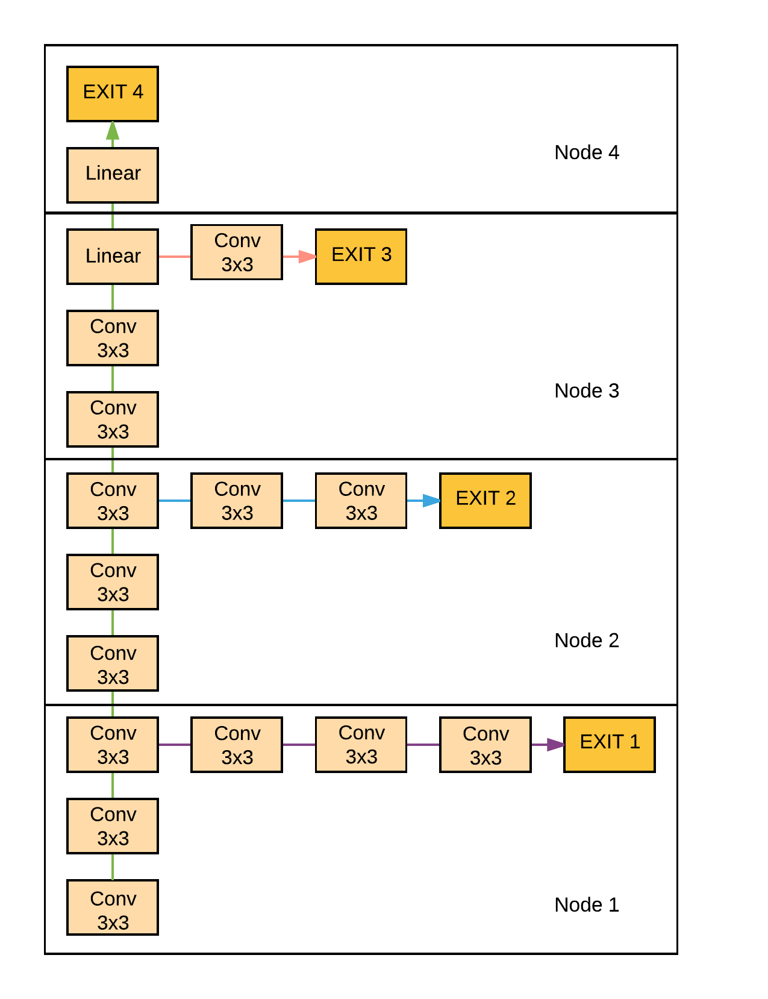
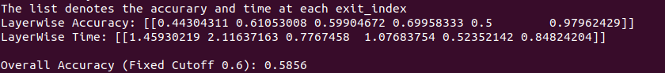
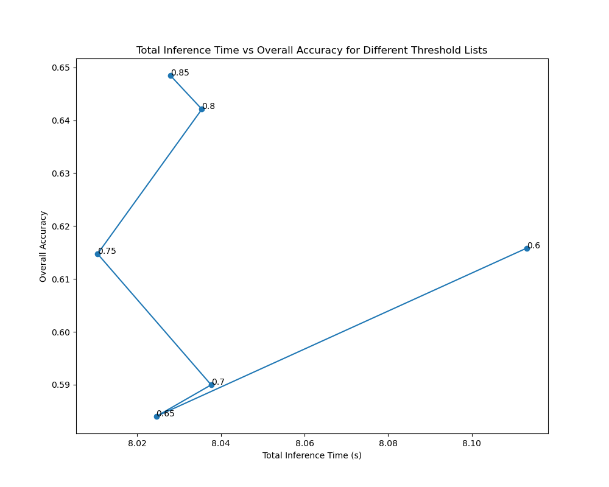

## Dynamic-Network-Inference
Code for Entropy-Based Early Exit on a pre-trained BrancyNet model pretrained for classification on CIFAR-10 data.  
The code analyses exit performance for all 5 exit layers.  


## Network Architecture 


## Results

We exit a sample if the entropy is greater than the threshold. Greater entropy means greater confidence in prediction.  
Overall Accuracy is calculated as a weighted mean (with the number of samples as weight) of accuracies at each exit.  

Following is the case when threshold is set to 0.6
<table>
  <tr>
      <td align = "center">  </td>
  </tr>
  <tr>
      <td align = "center"> For Entropy Threshold equal to 0.6 </td>
  </tr>
</table>

For plotting the following we have ranged the cutoffs from 0 till log(10) which is 2.71. For this part we have kept the thresholds the same across all layers. We see an inverse relation
between overall accuracy and cutoffs.


<table>
  <tr>
      <td align = "center">  </td>
  </tr>
  <tr>
      <td align = "center"> Relation between Cutoff, Latency and Accuracy </td>
  </tr>
</table>

We want to set the overall accuracy to be 80%. To do this, I iterate over the entire batch
for each layer and if I get the accuracy greater than the desired for that layer , I record the
entropy threshold for that layer to be 0. This basically means that all samples give the desired
accuracy without any threshold.  
If this is not the case, I record all the entropies in the validation data for that layer. I approximate
by saying that if I want 80% accuracy, I will have to take the threshold to be 20th percentile in all
the entropies recorded. This is not foolproof, but this made sense with the figure 1 as well where
we see an inverse relation between accuracy and cutoff.
Thus I would get approximate thresholds for each desired accuracy for each layer.  

I test this for many different desired accuracies and I get the following graph. In
this graph the numbers denote the overall weighted accuracy I get when setting the desired
accuracy to the number plotted for each layer.  

For every desired accuracy we would get a set of 6 parameters which denotes the thresholds at each exit
required for that configuration. Now we wish to choose the best set of parameters. We will have
6 sets of parameters here since we have tested on 6 different accuracies.  
We choose the best parameters by getting the configuration which gives us the best accuracy
in the least time(latency). To do this we choose the configuration which has the highest
accuracy to latency ratio.

<table>
  <tr>
      <td align = "center">  </td>
  </tr>
  <tr>
      <td align = "center"> Inference time vs Overall Accuracy for different Desired Accuracy  </td>
  </tr>
</table>

With the best set of parameters, I got an overall accuracy of is 64% and it took 7.2 seconds to run. 

## To Run
```
python3 code.py
```
